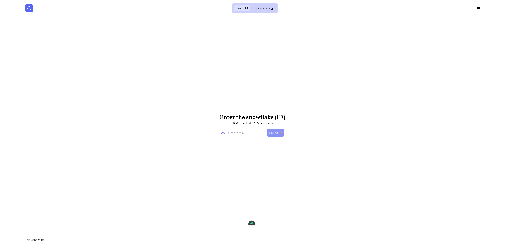

# Prodis

Find out more about your Discord account (and other Discord accounts using their IDs)

**Built with:**

     

## Why?

I don't know, cause I can duh

## Setup

**PS:** For this to work you need the following:

1. A developer account for Discord with a bot application which you can get from <https://discord.com/developers>
2. A key-value pair redis database

### Environment Variables

Just to get this out of the way, you'll need the following environment variables for this project to work

`*` is marked as important

```env
DISCORD_BOT_TOKEN *         // your bot token
DISCORD_CLIENT_ID *         // your application ID (or snowflake)
DISCORD_CLIENT_SECRET *     // your application secret
DISCORD_REDIRECT_URL *      // route to redirect to after authorizing the application
KV_URL *                    // your redis key-value database URL
TURNSTILE_SECRET_KEY        // the ID for your Turnstile protected site
TURNSTILE_SITE_KEY          // the secret for your Turnstile protected site
```

### Setting up

```zsh
# Run redis in the background with Docker
$ docker run -d --name prodis-redis -p 6379:6379 redis/redis-stack

# Install the goodies (sorry meant dependencies)
$ pnpm install

# For optional typechecking
$ pnpm install -g vue-tsc
```

#### Scripts

Here is a list of every possible command you can run and what they do

```sh
# Builds the project
$ pnpm build

# Run the development server on http://localhost:3000
$ pnpm dev

# Compiles and checks the types used
$ pnpm typecheck
```

#### Preview

If you did everything correctly you should see this, yay 🎉



#### Testing

There are no tests yet, I plan to add that in the future

### Contributing

Please refer to [this](CONTRIBUTING.md) to learn about the rules followed in the project

### Security

**PS:** I'm new to this, please don't go harsh on me

This is the structure of the request chain

`/api/public-key > /api/sign > /api/endpoint`

- `api/public-key`
  Accepts only a `GET` request. It generates a public-private key pair and saves the pair to redis using the request sessionId.
  When a request from the same sessionId happens, it fetches the keys from redis. It returns a `publicKey`
- `/api/sign`
  Accepts only a `POST` request. It gets the payload from the body and decrypts it contents, If keys were found attached to the sessionId with its `privateKey` . It returns a JWT token encrypted using the environment variable `JWT_SIGNING_KEY`
- `/api/endpoint`
  Could be any of the following [`/api/friends`, `/api/lookup`], all of which only accept a `GET` request. This routes get the `X-Token` header (the JWT token from the previous step) and decodes the data using the environment variable `JWT_SIGNING_KEY` and uses the payload before returning the response in `JSON` format

You can make an issue if you have other ways of securing the data and whatnot

### Notes

1. I suggest you use `pnpm` for this project (I can't assure you things will go well with `npm, yarn or your-own-depedency-manager`)
2. The `redirectURL` configured for this project is at `/api/callback`

Copyright © 2023 [OyewoleOyedeji](https://github.com/OyewoleOyedeji)
