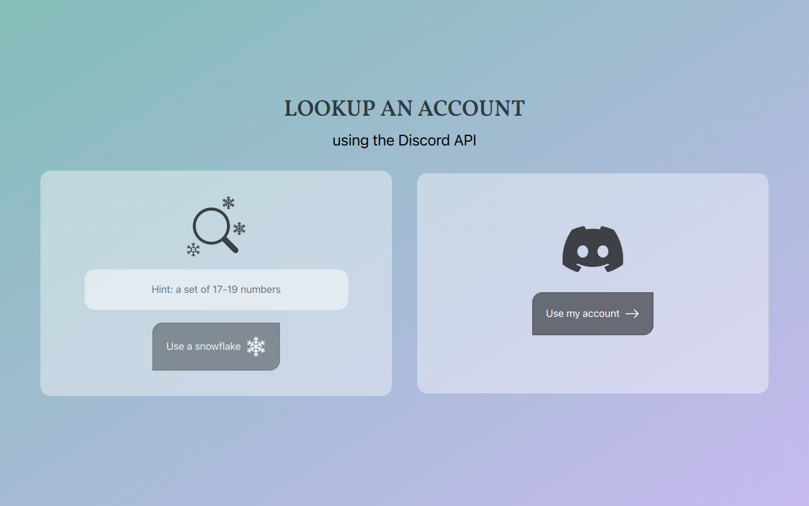

<div style="display: flex; gap: 1rem; align-items: center; justify-content: center;"><h1>Prodis</h1></div>



## Pre-requisites

1. Discord application (which happens to also be a bot)
   1. You'll need the `CLIENT_ID`, `CLIENT_SECRET` & `BOT_TOKEN` which you can get from <https://discord.com/developers>
2. A `SECRET` and `PUBLIC_SECRET` which can be generated with the following command
   1. Just make sure you have OpenSSL installed

## Setup

I would prefer you use `pnpm` for this workspace, so the following command/s will be biased 😀

```bash
pnpm install # or pnpm i (I know you're lazy to type it out)
```

When it's done, create a file named `development.json` in the `config` folder, with this format.
And I also watch `Fireship` so don't question my values

```json
{
  "discord": {
    "id": "DISCORD_CLIENT_ID",
    "secret": "DISCORD_CLIENT_SECRET",
    "botToken": "DISCORD_BOT_TOKEN"
  },
  "project": {
    "secret": "hi-mom",
    "public": {
      "secret": "hi-stepmom"
    }
  }
}
```

## Running

### Development

After running the command below you can access the project on <http://localhost:3000>

```bash
pnpm run dev # or pnpm dev
```

### Production

First of set the following environment variables (exactly the way they're named)

1. `DISCORD_CLIENT_ID`
2. `DISCORD_CLIENT_SECRET`
3. `DISCORD_BOT_TOKEN`
4. `SECRET`
5. `PUBLIC_SECRET`

After which you can run the command

```bash
pnpm run build # or pnpm build
```

After which you can locally preview/test the project on <http://localhost:3000> using the command

```bash
node .output/server/index.mjs

# Listening on http://[::]:3000
```

or, you can run the command, after setting the environment variables to run everything at once

```bash
pnpm run preview # or pnpm preview
```

<h4 style="text-align: center">Built with ❤️ and 🍞 by <a href="https://github.com/OyewoleOyedeji" target="_blank">OyewoleOyedeji</a></h4>
